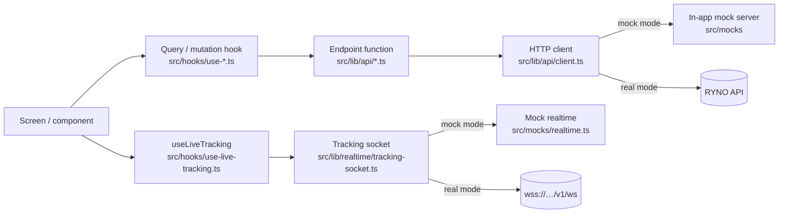
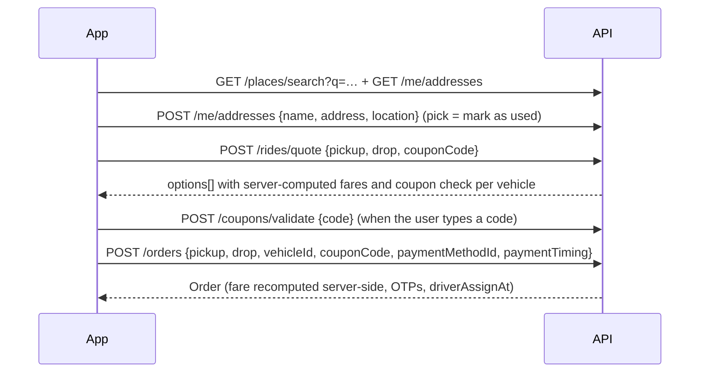
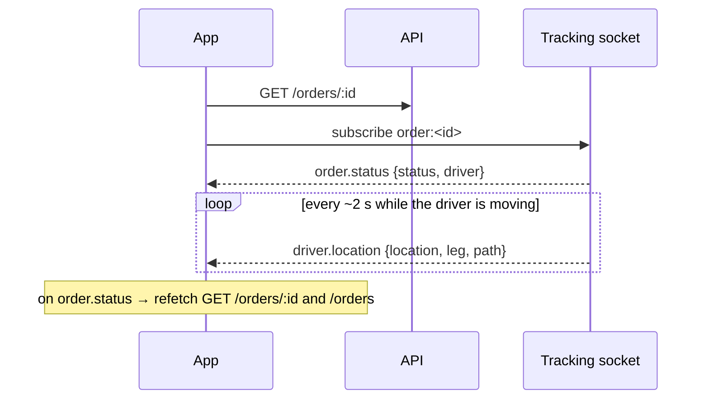

# RYNO customer app — API & data flow

Everything the app exchanges with the backend, in one place: how data moves
(REST, WebSocket, push, public tracking page), the shared conventions, and every
endpoint and socket event.

The app currently runs against an **in-app mock server** (`src/mocks`) that
implements exactly these contracts, so moving to a real backend is a
configuration change (see _Switching to the real backend_ below). Types for
every model live in `src/lib/api/models.ts`.

## Contents

- [1. Data flow & architecture](#1-data-flow--architecture)
- [2. API conventions](#2-api-conventions)
- [3. Endpoint index](#3-endpoint-index)
- [4. Auth & profile](#4-auth--profile)
- [5. Catalogue & pricing](#5-catalogue--pricing)
- [6. Places & saved addresses](#6-places--saved-addresses)
- [7. Orders](#7-orders)
- [8. Realtime tracking (WebSocket)](#8-realtime-tracking-websocket)
- [9. Wallet & payment methods](#9-wallet--payment-methods)
- [10. Content](#10-content)

---

## 1. Data flow & architecture

### Transport choice

| Data                                                                                         | Transport                                                                                   | Why                                                                                   |
| -------------------------------------------------------------------------------------------- | ------------------------------------------------------------------------------------------- | ------------------------------------------------------------------------------------- |
| Everything the user reads or changes on request (login, addresses, quotes, orders, wallet)   | **REST over HTTPS** (JSON)                                                                  | Request/response, cacheable, easy to retry and debug, works with any backend stack    |
| Live order status and driver location while a tracking screen is open                        | **WebSocket** (`wss://…/v1/ws`)                                                             | Server pushes every 2–5 s; polling that often wastes battery and data and still lags  |
| Status changes while the app is closed or in the background ("Driver assigned", "Delivered") | **Push notifications** (APNs/FCM via `expo-notifications`)                                  | Sockets are closed in the background; push wakes the user and deep-links to the order |
| Receiver without the app                                                                     | **Web tracking page** at `https://ryno.app/track/<token>`, which opens the app if installed | No login or install needed to follow a delivery                                       |

Why not only polling? Tracking needs second-level freshness; polling would mean
a request every 2 s per viewer. Why not only sockets? Sockets are a poor fit
for CRUD, don't cache, and can't reach a backgrounded app. The split above is
the standard setup for delivery apps (REST + socket + push).

Server-Sent Events would also work for the one-way tracking stream, but a
WebSocket leaves room for the driver app (which sends location) to share the
same gateway, and React Native supports WebSockets natively.

### Layers in the app



Rules (from `.agents/skills/odin-component-architecture/references/api-and-server-state.md`):

- Screens never call Axios directly. They use hooks; hooks call endpoint
  functions; endpoint functions call `request()` in the client.
- **Server data lives only in the TanStack Query cache.** Zustand holds only
  client state: the session (`use-auth-store`) and the booking draft
  (`trip-store`).
- Every failed call becomes an `ApiError` (`kind`, `status`, backend `code`,
  user-facing `message`). A 401 anywhere signs the user out.
- Queries retry transient failures twice; 4xx errors and mutations never retry.
- On logout the whole query cache is cleared so the next account starts clean.

### Main flows

#### Login

```mermaid
sequenceDiagram
  participant App
  participant API
  App->>API: POST /auth/otp/send {email}
  API-->>App: {otpLength, resendInSeconds}
  App->>API: POST /auth/otp/verify {email, otp}
  API-->>App: {accessToken, refreshToken, user}
  Note over App: store session; user.isOnboarded ? Home : Onboarding
  App->>API: PATCH /me {name, phone}   (onboarding)
```

#### Booking



The quote is display-only: `POST /orders` always recomputes the price, so a
tampered client can't change what the user pays.

#### Live tracking (sender)



Driver location is ephemeral UI state (kept in the screen, not the cache).
Status pushes trigger a refetch of the authoritative order.

#### Receiver sharing

1. Sender taps **Share tracking** → `POST /orders/:id/share` returns a
   24-hour token and `https://ryno.app/track/<token>`.
2. The OS share sheet sends the link (WhatsApp/SMS/…).
3. The receiver opens it: the web page, or the app's public route
   `/track/[token]` (no login). It calls `GET /tracking/:token` and subscribes
   to `tracking:<token>`.
4. The page shows live status, the driver (name, vehicle, call button) and the
   **delivery OTP**. The receiver reads the OTP to the driver at drop; the
   driver app submits it to complete the delivery.

Two OTPs keep each hand-over honest: the **pickup OTP** is seen only by the
sender, the **delivery OTP** only by the sender and whoever has the link.

Recommended next steps for receivers: an SMS with the link sent by the backend
when the order is created (the receiver's phone is already collected), a
"Delivery photo" at drop, and optional "leave with security" instructions.

### Mock mode

`src/lib/api/config.ts`: when `EXPO_PUBLIC_API_URL` is not set, the Axios
client uses `src/mocks/adapter.ts`, which routes every request to handlers in
`src/mocks/handlers` with 250–650 ms latency, real status codes and error
envelopes. Data persists in MMKV (`mock_db_v2:*`), so orders survive restarts.

The mock simulates what the driver app would do: a driver is assigned 8–25 s
after booking, reaches pickup 30 s later (compressed from the vehicle's
`etaMinutes`, which is still what the app displays), and delivers one minute
after that — about 2 minutes end to end. Demo login code: **1234**. A new account's wallet
starts with a seeded transaction history and the balance it adds up to.

### Switching to the real backend

1. Set `EXPO_PUBLIC_API_URL=https://api.ryno.app/v1` and
   `EXPO_PUBLIC_WS_URL=wss://api.ryno.app/v1/ws` in `.env`.
2. The client stops using the mock adapter; the tracking socket connects with
   `?token=<accessToken>` and resubscribes after reconnects (exponential
   backoff up to 30 s).
3. Move the access token from MMKV to `expo-secure-store` and add a refresh
   flow (single in-flight refresh on 401) — the mock issues a refresh token
   but no refresh endpoint yet.
4. Remove `src/mocks` from release builds.

Device-side pieces that should move server-side later: free-text geocoding
(currently the phone's geocoder; use a places API such as Ola Maps via the
backend) and road distance (currently straight-line × 1.3).

---

## 2. API conventions

- **Base URL:** `https://api.ryno.app/v1` (`EXPO_PUBLIC_API_URL`). All paths below are relative to it.
- **Format:** JSON request and response bodies, UTF-8, ISO-8601 UTC timestamps.
- **Auth:** `Authorization: Bearer <accessToken>` on every endpoint except those marked _Public_.
- **Money:** rupees as numbers (`249`, `283.82`). **Coordinates:** `{ "latitude": 28.63, "longitude": 77.21 }`.

### Response envelope

Success:

```json
{
  "success": true,
  "statusCode": 200,
  "message": "Order placed",
  "data": {},
  "timestamp": "2026-09-23T10:00:00.000Z"
}
```

Error:

```json
{
  "success": false,
  "statusCode": 409,
  "error": "CANNOT_CANCEL",
  "message": "Your package has already been picked up.",
  "timestamp": "2026-09-23T10:00:00.000Z"
}
```

`message` is safe to show to users. `error` is a stable machine code.

| Status | Meaning                                          |
| ------ | ------------------------------------------------ |
| 400    | Malformed request / wrong OTP                    |
| 401    | Missing or expired token — the app signs out     |
| 404    | Resource not found (or not yours)                |
| 409    | Action not allowed in the current state          |
| 410    | Expired (e.g. tracking link)                     |
| 422    | Validation failed                                |
| 5xx    | Server error — the app retries reads up to twice |

### Idempotency

`POST /orders` should accept an `Idempotency-Key` header so a retried request
after a timeout can't create two orders. (Not sent by the prototype yet.)

---

## 3. Endpoint index

| Method   | Path                          | Auth   | Section             |
| -------- | ----------------------------- | ------ | ------------------- |
| `POST`   | `/auth/otp/send`              | Public | Auth & profile      |
| `POST`   | `/auth/otp/verify`            | Public | Auth & profile      |
| `GET`    | `/me`                         | Bearer | Auth & profile      |
| `PATCH`  | `/me`                         | Bearer | Auth & profile      |
| `GET`    | `/config/languages`           | Public | Auth & profile      |
| `GET`    | `/vehicles`                   | Public | Catalogue & pricing |
| `POST`   | `/rides/quote`                | Bearer | Catalogue & pricing |
| `POST`   | `/coupons/validate`           | Bearer | Catalogue & pricing |
| `GET`    | `/offers/banners`             | Public | Catalogue & pricing |
| `GET`    | `/places/search?q=`           | Bearer | Places & addresses  |
| `GET`    | `/me/addresses`               | Bearer | Places & addresses  |
| `POST`   | `/me/addresses`               | Bearer | Places & addresses  |
| `PATCH`  | `/me/addresses/:id`           | Bearer | Places & addresses  |
| `PUT`    | `/me/addresses/:id/contact`   | Bearer | Places & addresses  |
| `POST`   | `/me/addresses/:id/favorite`  | Bearer | Places & addresses  |
| `DELETE` | `/me/addresses/:id`           | Bearer | Places & addresses  |
| `POST`   | `/orders`                     | Bearer | Orders              |
| `GET`    | `/orders`                     | Bearer | Orders              |
| `GET`    | `/orders/:id`                 | Bearer | Orders              |
| `POST`   | `/orders/:id/cancel`          | Bearer | Orders              |
| `POST`   | `/orders/:id/rating`          | Bearer | Orders              |
| `POST`   | `/orders/:id/share`           | Bearer | Orders              |
| `GET`    | `/tracking/:token`            | Public | Orders              |
| `GET`    | `/me/wallet`                  | Bearer | Wallet              |
| `POST`   | `/me/wallet/topups`           | Bearer | Wallet              |
| `POST`   | `/me/payment-methods`         | Bearer | Wallet              |
| `PUT`    | `/me/payment-methods/default` | Bearer | Wallet              |
| `GET`    | `/me/account-summary`         | Bearer | Content             |
| `GET`    | `/support`                    | Public | Content             |

The live tracking socket is described in section 8.

---

## 4. Auth & profile

### POST /auth/otp/send — _Public_

Sends a login code to the email.

```json
{ "email": "akash@example.com" }
```

Response `data`:

```json
{ "otpLength": 4, "resendInSeconds": 24, "expiresInSeconds": 300 }
```

Errors: `422 INVALID_EMAIL`.

### POST /auth/otp/verify — _Public_

```json
{ "email": "akash@example.com", "otp": "1234" }
```

Response `data` (`AuthSession`):

```json
{
  "accessToken": "at_…",
  "refreshToken": "rt_…",
  "user": {
    "id": "usr_…",
    "email": "akash@example.com",
    "name": "",
    "phone": null,
    "usageType": "personal",
    "isOnboarded": false
  }
}
```

Creates the account on first login. The app routes to onboarding while
`isOnboarded` is false. Errors: `400 INVALID_OTP`, `422 INVALID_EMAIL`.

### GET /me

Returns the current `User`.

### PATCH /me

Completes onboarding / edits the profile.

```json
{ "name": "Akash Patel", "phone": "9876543210", "usageType": "personal" }
```

Returns the updated `User`; `isOnboarded` becomes true once name and phone are
set. Errors: `422 INVALID_NAME`.

### GET /config/languages — _Public_

```json
[{ "code": "hi", "label": "Hindi", "nativeLabel": "हिन्दी" }]
```

---

## 5. Catalogue & pricing

### GET /vehicles — _Public_

Vehicle types for the home grid.

```json
{
  "featured": [
    {
      "id": "bike",
      "name": "Bike",
      "description": "Up to 20 kg · Documents, food, small parcels",
      "capacityKg": 20,
      "imageKey": "bike"
    }
  ],
  "standard": [
    {
      "id": "large-truck",
      "name": "Large Truck",
      "description": null,
      "capacityKg": 2500,
      "imageKey": "large-truck"
    }
  ]
}
```

`imageKey` maps to artwork bundled in the app; production can return an image URL instead.

### POST /rides/quote

Prices every vehicle for a trip, and checks a coupon against each.

```json
{
  "pickup": { "latitude": 28.628, "longitude": 77.2405 },
  "drop": { "latitude": 28.6315, "longitude": 77.2167 },
  "couponCode": "RYNO50"
}
```

`pickup`/`drop` may be `null` (flat fares are returned). Response `data`:

```json
{
  "distanceKm": 3.1,
  "couponCode": "RYNO50",
  "options": [
    {
      "vehicleId": "bike",
      "name": "Bike",
      "description": "Up to 20 kg · Documents, food, small parcels",
      "imageKey": "bike",
      "etaMinutes": 8,
      "fare": 80,
      "coupon": { "valid": true, "discount": 40 }
    },
    {
      "vehicleId": "large-truck",
      "name": "Large Truck",
      "description": "Up to 2,500 kg · House shifting, heavy loads",
      "imageKey": "large-truck",
      "etaMinutes": 25,
      "fare": 639,
      "coupon": { "valid": false, "reason": "Not valid for this vehicle" }
    }
  ]
}
```

Pricing (prototype): `baseFare + perKmRate × roadKm`, where road km is
straight-line distance × 1.3 (min 1 km). The quote is for display; the order
endpoint recomputes the price.

### POST /coupons/validate

```json
{ "code": "truck150" }
```

Codes are case-insensitive. Response `data`:

```json
{
  "code": "TRUCK150",
  "title": "Flat ₹150 off on trucks",
  "description": "Valid on Mini Truck, Pickup Truck and Large Truck. Min order ₹300."
}
```

Errors: `404 INVALID_COUPON` ("Invalid coupon code"). Vehicle and minimum-order
eligibility is reported per option by `/rides/quote`.

### GET /offers/banners — _Public_

Promotional banner images for home. The coupon code is printed on the image;
banners are not tappable.

```json
[
  {
    "id": "banner-first-delivery",
    "imageKey": "first-delivery",
    "altText": "50% off your first delivery, up to ₹100. Use code RYNO50."
  }
]
```

---

## 6. Places & saved addresses

### GET /places/search?q=

Known places matching the text (name or address). Returns `[]` for an empty query.

```json
[
  {
    "id": "place-cp",
    "name": "Connaught Place",
    "address": "Rajiv Chowk, New Delhi",
    "location": { "latitude": 28.6315, "longitude": 77.2167 }
  }
]
```

Free text that no place matches is resolved on the device (phone geocoder) in
the prototype; production should proxy a places API (e.g. Ola Maps) here.

### GET /me/addresses

The user's addresses, most recently used first (max 12).

```json
[
  {
    "id": "addr_…",
    "name": "Connaught Place",
    "address": "Rajiv Chowk, New Delhi",
    "label": "recent",
    "isFavorite": false,
    "location": { "latitude": 28.6315, "longitude": 77.2167 },
    "contact": { "name": "Ravi", "phone": "9876543210", "houseNumber": "" },
    "lastUsedAt": "2026-09-23T10:00:00.000Z"
  }
]
```

`label` is `recent | home | work | other`. `contact` is the sender/receiver last
used at this address, so the next booking pre-fills it.

### POST /me/addresses

Saves an address, or — if one with the same name and address exists — marks it
as just used. Called whenever the user picks an address.

```json
{
  "name": "Connaught Place",
  "address": "Rajiv Chowk, New Delhi",
  "location": { "latitude": 28.6315, "longitude": 77.2167 }
}
```

Returns the `SavedAddress` (`201` when created).

### PATCH /me/addresses/:id

Edit name, address, location or label. Any subset of:

```json
{
  "name": "Office",
  "address": "Tower B, Cyber City",
  "location": { "latitude": 28.49, "longitude": 77.08 },
  "label": "work"
}
```

### PUT /me/addresses/:id/contact

```json
{ "name": "Ravi", "phone": "9876543210", "houseNumber": "A-42" }
```

### POST /me/addresses/:id/favorite

Toggles `isFavorite`. Returns the address.

### DELETE /me/addresses/:id

Returns `data: null`.

---

## 7. Orders

### The Order model

```json
{
  "id": "ord_…",
  "number": "RY4F2K9",
  "createdAt": "2026-09-23T10:00:00.000Z",
  "status": "heading_to_pickup",
  "pickup": {
    "label": "Hans Bhawan Wing-1, IP Estate, New Delhi",
    "location": { "latitude": 28.628, "longitude": 77.2405 },
    "houseNumber": "",
    "contact": { "name": "Akash", "phone": "9876543210" }
  },
  "drop": {
    "label": "Connaught Place",
    "location": { "latitude": 28.6315, "longitude": 77.2167 },
    "houseNumber": "A-42",
    "contact": { "name": "Ravi", "phone": "9123456780" }
  },
  "vehicle": { "id": "bike", "name": "Bike", "imageKey": "bike" },
  "pricing": {
    "fare": 80,
    "discount": 40,
    "payable": 40,
    "couponCode": "RYNO50",
    "distanceKm": 3.1
  },
  "payment": { "methodLabel": "Cash", "timing": "on-delivery" },
  "etaMinutes": 8,
  "driverAssignAt": "2026-09-23T10:00:14.000Z",
  "driver": {
    "id": "drv-3",
    "name": "Suresh Yadav",
    "rating": 4.7,
    "phone": "+919845010003",
    "vehicleLabel": "Bike",
    "vehiclePlate": "HR 26 BK 5521"
  },
  "pickupOtp": "4821",
  "deliveryOtp": "7390",
  "route": [
    { "latitude": 28.628, "longitude": 77.2405 },
    { "latitude": 28.6315, "longitude": 77.2167 }
  ],
  "rating": null,
  "cancelledAt": null
}
```

| `status`            | Meaning                     | Moves on when                      |
| ------------------- | --------------------------- | ---------------------------------- |
| `searching`         | Looking for a driver        | A driver accepts                   |
| `heading_to_pickup` | Driver on the way to pickup | Driver enters the **pickup OTP**   |
| `pickup_complete`   | Package on the way to drop  | Driver enters the **delivery OTP** |
| `delivered`         | Done                        | —                                  |
| `cancelled`         | Cancelled by the customer   | —                                  |

`driver` is `null` until assigned. `driverAssignAt` is the (estimated)
assignment time, used for the "~N min" countdown.

### POST /orders

```json
{
  "pickup": {
    "label": "…",
    "location": { "latitude": 28.628, "longitude": 77.2405 },
    "houseNumber": "",
    "contact": { "name": "Akash", "phone": "9876543210" }
  },
  "drop": {
    "label": "…",
    "location": { "latitude": 28.6315, "longitude": 77.2167 },
    "houseNumber": "A-42",
    "contact": { "name": "Ravi", "phone": "9123456780" }
  },
  "vehicleId": "bike",
  "couponCode": "RYNO50",
  "paymentMethodId": "cash",
  "paymentTiming": "on-delivery"
}
```

The server recomputes fare and discount (an ineligible coupon is ignored),
generates both OTPs, and returns the `Order` with `201`.
Errors: `422 INVALID_STOP | INVALID_VEHICLE | INVALID_PAYMENT_METHOD`.

### GET /orders

The user's orders, newest first. The app polls every 15 s only while an order
is active, and pull-to-refresh on the Orders tab.

### GET /orders/:id

One order. `404 ORDER_NOT_FOUND` if it isn't the caller's.

### POST /orders/:id/cancel

Allowed while `searching` or `heading_to_pickup`. Returns the cancelled order.
Errors: `409 CANNOT_CANCEL`.

### POST /orders/:id/rating

```json
{ "rating": 5 }
```

Only after `delivered`. Errors: `409 NOT_DELIVERED`, `422 INVALID_RATING`.

### POST /orders/:id/share

Creates a receiver tracking link valid for 24 hours.

```json
{
  "token": "mfx2k9ab3",
  "url": "https://ryno.app/track/mfx2k9ab3",
  "expiresAt": "2026-09-24T10:00:00.000Z"
}
```

### GET /tracking/:token — _Public_

What the receiver sees. Contains no sender phone, pickup OTP, pricing or
payment details.

```json
{
  "orderNumber": "RY4F2K9",
  "status": "pickup_complete",
  "senderName": "Akash",
  "pickupLabel": "Hans Bhawan Wing-1, IP Estate, New Delhi",
  "dropLabel": "Connaught Place",
  "vehicleName": "Bike",
  "vehicleImageKey": "bike",
  "etaMinutes": 8,
  "driverAssignAt": "2026-09-23T10:00:14.000Z",
  "driver": {
    "name": "Suresh Yadav",
    "rating": 4.7,
    "phone": "+919845010003",
    "vehicleLabel": "Bike",
    "vehiclePlate": "HR 26 BK 5521"
  },
  "deliveryOtp": "7390",
  "route": [
    { "latitude": 28.628, "longitude": 77.2405 },
    { "latitude": 28.6315, "longitude": 77.2167 }
  ]
}
```

Errors: `404 LINK_NOT_FOUND`, `410 LINK_EXPIRED`. Live updates: subscribe to
`tracking:<token>` on the [tracking socket](#8-realtime-tracking-websocket).

---

## 8. Realtime tracking (WebSocket)

**URL:** `wss://api.ryno.app/v1/ws?token=<accessToken>` (`EXPO_PUBLIC_WS_URL`).
The token is optional: without it only `tracking:<token>` channels (shared
links) can be joined.

One connection per app; the client subscribes to channels while a tracking
screen is open and unsubscribes when it closes. After a disconnect it
reconnects with exponential backoff (1 s → 30 s) and resubscribes.

### Client → server

```json
{ "type": "subscribe", "channel": "order:ord_123" }
{ "type": "unsubscribe", "channel": "order:ord_123" }
```

| Channel                 | Who      | Auth                              |
| ----------------------- | -------- | --------------------------------- |
| `order:<orderId>`       | Sender   | Bearer token of the order's owner |
| `tracking:<shareToken>` | Receiver | The share token itself            |

### Server → client

Every message is `{ "channel": "…", "event": { … } }`.

On subscribe, the server sends the current `order.status` immediately, then:

#### order.status

Sent when the status or driver changes. The app refetches `GET /orders/:id`
(or `GET /tracking/:token`) on receipt.

```json
{
  "channel": "order:ord_123",
  "event": {
    "type": "order.status",
    "status": "heading_to_pickup",
    "driver": {
      "id": "drv-3",
      "name": "Suresh Yadav",
      "rating": 4.7,
      "phone": "+919845010003",
      "vehicleLabel": "Bike",
      "vehiclePlate": "HR 26 BK 5521"
    },
    "at": "2026-09-23T10:00:14.000Z"
  }
}
```

#### driver.location

Every 2–5 s while the driver is moving (`heading_to_pickup`,
`pickup_complete`). `path` is the remaining route of the current leg.

```json
{
  "channel": "order:ord_123",
  "event": {
    "type": "driver.location",
    "location": { "latitude": 28.6301, "longitude": 77.2352 },
    "leg": "to_pickup",
    "path": [
      { "latitude": 28.6301, "longitude": 77.2352 },
      { "latitude": 28.628, "longitude": 77.2405 }
    ],
    "updatedAt": "2026-09-23T10:03:00.000Z"
  }
}
```

Location is not persisted in the app cache — it's only drawn on the map.

### Background

The socket is only open while a tracking screen is visible. Status changes
while the app is backgrounded should be delivered as push notifications
(`expo-notifications`) with `{ "orderId": "…" }` so tapping opens tracking.

---

## 9. Wallet & payment methods

### GET /me/wallet

```json
{
  "balance": 500,
  "defaultPaymentMethodId": "cash",
  "paymentMethods": [
    { "id": "cash", "type": "cash", "label": "Cash", "subtitle": "Pay the driver directly" },
    { "id": "upi_…", "type": "upi", "label": "akash@okaxis", "subtitle": "UPI" }
  ],
  "transactions": [
    {
      "id": "txn_…",
      "title": "Wallet Top Up",
      "createdAt": "2026-09-10T10:00:00.000Z",
      "amount": 500,
      "kind": "credit"
    }
  ]
}
```

`defaultPaymentMethodId` is the method used for new bookings.

### POST /me/wallet/topups

```json
{ "amount": 500 }
```

Returns the updated wallet (`201`). Production: create a payment intent with
the gateway first and credit the wallet from the gateway's webhook.
Errors: `422 INVALID_AMOUNT`.

### POST /me/payment-methods

One of:

```json
{ "type": "upi", "upiId": "akash@okaxis" }
{ "type": "card", "cardNumber": "4111111111111111" }
{ "type": "paytm" }
```

The new method becomes the default. Returns the updated wallet (`201`).
Production: never send raw card numbers — tokenize with the payment gateway's
SDK and send the token. Errors: `422 INVALID_UPI | INVALID_CARD`.

### PUT /me/payment-methods/default

```json
{ "paymentMethodId": "upi_…" }
```

Returns the updated wallet. Errors: `404 METHOD_NOT_FOUND`.

---

## 10. Content

### GET /me/account-summary

```json
{
  "rating": 4.93,
  "promoItems": [
    {
      "id": "safety",
      "title": "Safety check-up",
      "subtitle": "Learn ways to make rides safer",
      "icon": "checkmark.shield.fill"
    }
  ],
  "menuLinks": [{ "id": "refer", "label": "Refer & Earn" }]
}
```

`icon` is an SF Symbol name the app maps to a native icon.

### GET /support — _Public_

```json
{
  "phone": "+911800000000",
  "email": "support@ryno.in",
  "faqs": [{ "id": "faq-otp", "question": "Why do I need to share the pickup OTP?", "answer": "…" }]
}
```
